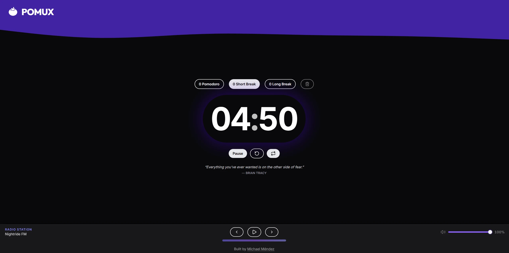
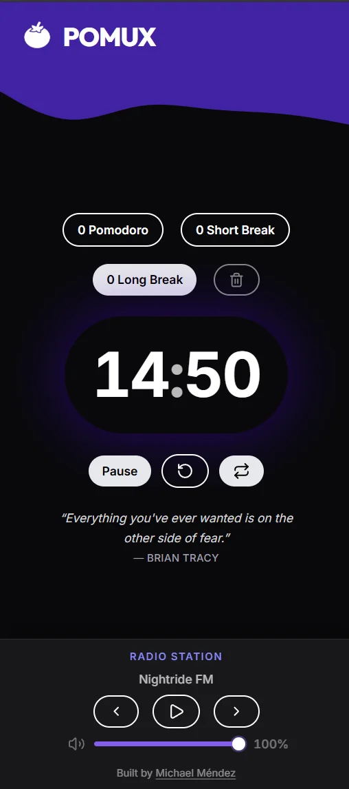
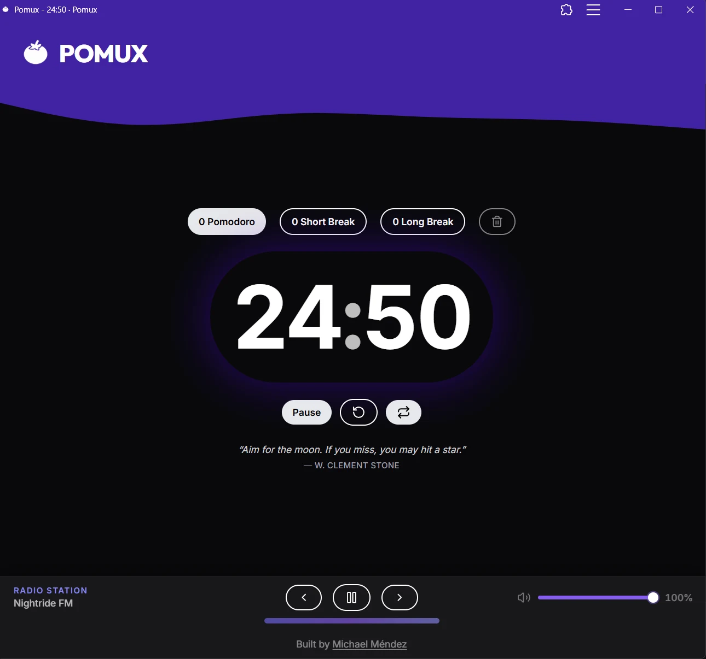

# Pomux

A Pomodoro timer built to help you stay focused without getting in the way. Three modes — Pomodoro, Short Break, Long Break — automatic cycle progression following the classic Pomodoro Technique, a settings modal for custom timer durations, session tracking that survives page refreshes, a motivational quote pulled on load, and a built-in lofi radio player to keep you in the zone. It works offline and can be installed as a PWA.

Built with React 19, TypeScript, Tailwind CSS v4, and Vite.

---

**Desktop**



**Mobile**



**PWA**



---

## Features

- Three timer modes: Pomodoro (25 min), Short Break (5 min), Long Break (15 min)
- Settings modal with slider controls to customize work/short/long durations (1-100 min)
- Custom durations persisted in localStorage and shared through context
- Automatic Pomodoro cycle — every 4th Pomodoro triggers a long break, otherwise a short break; breaks return to Pomodoro automatically
- Auto-start toggle — chains sessions without manual input, persisted in localStorage
- Session counter per timer type, persisted in localStorage
- Sound notification when a session ends
- Motivational quotes from [ZenQuotes](https://zenquotes.io/) through a same-origin `/api/quote` proxy, rotating every 30 seconds with smooth transitions and offline fallbacks
- Dynamic browser tab title showing the remaining time
- Lofi/synthwave radio player powered by the [RadioBrowser API](https://www.radio-browser.info/) — no account required
- Installable as a Progressive Web App (PWA)
- Fully responsive

---

## Getting Started

**Prerequisites:** Node.js and pnpm installed.

```bash
pnpm install
```

Copy the environment file and fill in your values:

```bash
cp .env.example .env
```

```bash
pnpm dev
```

The dev server runs at `http://localhost:5173`.

---

## Environment Variables

All variables are validated at startup via `src/constants/env.ts`.

| Variable                  | Description                                                               | Example value                                                                                            |
| ------------------------- | ------------------------------------------------------------------------- | -------------------------------------------------------------------------------------------------------- |
| `VITE_RADIO_STATIONS_URL` | [RadioBrowser API](https://www.radio-browser.info/) endpoint for stations | `https://de1.api.radio-browser.info/json/stations/bytag/synthwave?limit=20&hidebroken=true&order=random` |
| `VITE_QUOTES_URL`         | Same-origin quote endpoint used by the app                                | `/api/quote`                                                                                             |
| `VITE_GITHUB_URL`         | Author GitHub profile URL                                                 | `https://github.com/michaelmendez`                                                                       |

### Cloudflare Pages (with Functions)

The project includes a Pages Function at `functions/api/quote.js` that proxies ZenQuotes, so browsers avoid CORS issues.

In Cloudflare Pages, add these as **Build environment variables**:

1. Open your Pages project.
2. Go to **Settings** -> **Builds & deployments** -> **Environment variables**.
3. Add `VITE_RADIO_STATIONS_URL`, `VITE_QUOTES_URL`, and `VITE_GITHUB_URL` for both Preview and Production.
4. Redeploy.

Set `VITE_QUOTES_URL=/api/quote` in both environments.

### Local Development

`pnpm dev` works with `/api/quote` because Vite proxies that route to ZenQuotes during development.

---

## Scripts

| Command        | Description                          |
| -------------- | ------------------------------------ |
| `pnpm dev`     | Start the development server         |
| `pnpm build`   | Type-check and build for production  |
| `pnpm preview` | Preview the production build locally |

---

## Tech Stack

- React 19 with the React Compiler (via Babel)
- TypeScript
- Tailwind CSS v4
- Vite 8
- vite-plugin-pwa + Workbox
- lucide-react for icons

---

## Built by

[Michael Méndez](https://github.com/michaelmendez)
