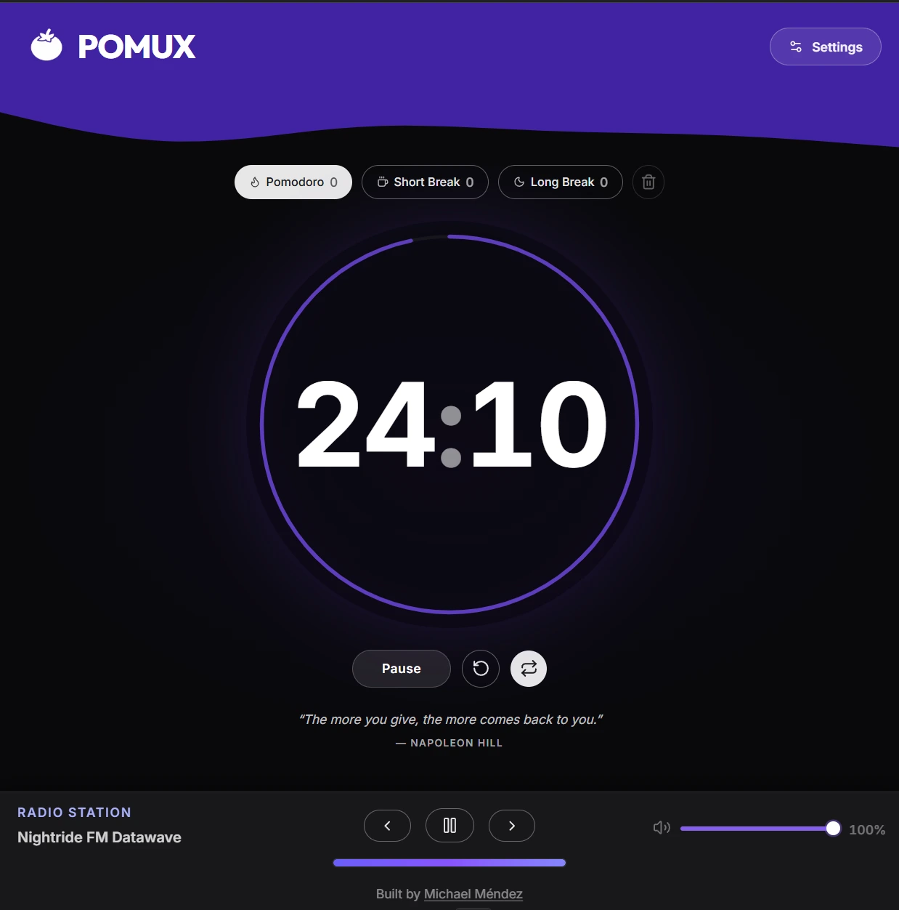

# Pomux

A Pomodoro timer built to help you stay focused without getting in the way. Three modes — Pomodoro, Short Break, Long Break — automatic cycle progression following the classic Pomodoro Technique, a settings modal for custom timer durations, session tracking that survives page refreshes, a motivational quote pulled on load, and a built-in synthwave radio player to keep you in the zone. It works offline and can be installed as a PWA.

Built with React 19, TypeScript, Tailwind CSS v4, and Vite.

Live demo: <a href="https://pomux.xyz" target="_blank" rel="noopener noreferrer">https://pomux.xyz</a>

---



---

## Features

- Three timer modes: Pomodoro (25 min), Short Break (5 min), Long Break (15 min)
- Settings modal with slider controls to customize work/short/long durations and daily goal
- Custom durations persisted in localStorage and shared through context
- Automatic Pomodoro cycle — every 4th Pomodoro triggers a long break, otherwise a short break; breaks return to Pomodoro automatically
- Auto-start toggle — chains sessions without manual input, persisted in localStorage
- Session counter per timer type, persisted in localStorage
- Daily goal tracker with progress bar showing completed pomodoros vs daily target, persisted in localStorage
- Reset sessions clears both session counts and daily goal progress
- End-of-session alerts with independent toggles for desktop notifications and sound
- Notification permission flow handled from Settings (user-triggered, no intrusive auto-prompt)
- Motivational quotes loaded from local app data with smooth transitions and offline behavior
- Dynamic browser tab title showing the remaining time
- Synthwave radio player powered by the [RadioBrowser API](https://www.radio-browser.info/) — no account required
- Mobile-optimized radio section with a collapsible control panel to save vertical space
- Installable as a Progressive Web App (PWA)
- Fully responsive

---

## Getting Started

**Prerequisites:** Node.js and pnpm installed.

```bash
pnpm install
```

Copy the environment file and fill in your values:

```bash
cp .env.example .env
```

```bash
pnpm dev
```

The dev server runs at `http://localhost:5173`.

---

## Environment Variables

All variables are validated at startup via `src/constants/env.ts`.

| Variable                  | Description                                                               | Example value                                                                                            |
| ------------------------- | ------------------------------------------------------------------------- | -------------------------------------------------------------------------------------------------------- |
| `VITE_RADIO_STATIONS_URL` | [RadioBrowser API](https://www.radio-browser.info/) endpoint for stations | `https://de1.api.radio-browser.info/json/stations/bytag/synthwave?limit=20&hidebroken=true&order=random` |
| `VITE_GITHUB_URL`         | Author GitHub profile URL                                                 | `https://github.com/michaelmendez`                                                                       |

### Deployment

Motivational quotes are now loaded from local app data and do not require ZenQuotes or an API proxy.

For local development, run `pnpm dev` normally. The app no longer depends on `/api/quote` or any external quote proxy.

---

## Scripts

| Command              | Description                                    |
| -------------------- | ---------------------------------------------- |
| `pnpm dev`           | Start the development server                   |
| `pnpm build`         | Type-check and build for production            |
| `pnpm preview`       | Preview the production build locally           |
| `pnpm deploy:pages`  | Deploy to Cloudflare Pages with Functions      |
| `pnpm deploy:worker` | Deploy as Cloudflare Worker with static assets |

---

## Tech Stack

- React 19 with the React Compiler (via Babel)
- TypeScript
- Tailwind CSS v4
- Vite 8
- vite-plugin-pwa + Workbox
- Heroicons for icons

---

## Built by

[Michael Méndez](https://github.com/michaelmendez)
